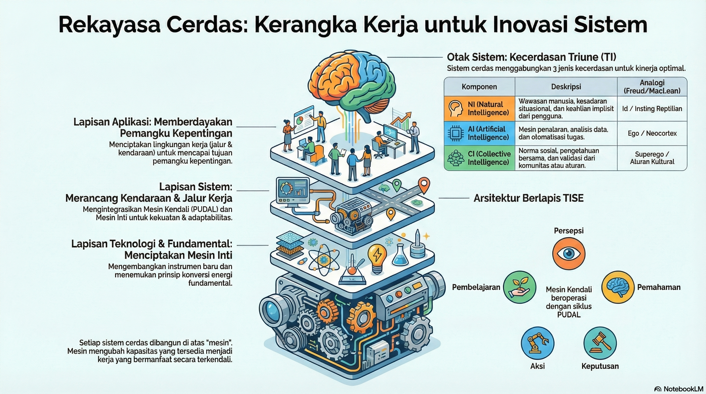

# UAS-1 My Concepts
<<<<<<< HEAD
Implementasi Sistem Teknologi Informasi (STI) berperan sebagai tulang punggung (backbone) yang memungkinkan komunikasi interpersonal dan publik mengenai krisis air bersih menjadi lebih akurat, transparan, dan terukur. Dalam mata kuliah STI, kita memahami bahwa informasi adalah aset strategis; dalam konteks SDG 6, STI berfungsi mengubah data mentah dari lapangan menjadi pengetahuan yang dapat mendorong tindakan nyata melalui integrasi perangkat keras, perangkat lunak, dan jaringan komunikasi.

Dalam ranah Komunikasi Interpersonal, STI menyediakan alat digital seperti aplikasi mobile health (m-Health) atau crowdsourcing platform yang memperkuat interaksi antara petugas lapangan dan masyarakat. Dengan bantuan sensor Internet of Things (IoT) yang terhubung ke jaringan, data kualitas air dapat dipantau secara real-time. Petugas tidak lagi hanya mengandalkan asumsi saat mengedukasi warga, melainkan menggunakan data akurat yang ditampilkan melalui antarmuka aplikasi. Hal ini meminimalkan hambatan komunikasi (noise) dan mempercepat feedback loop, di mana warga dapat langsung melaporkan kerusakan infrastruktur air melalui sistem informasi berbasis komunitas, sehingga tercipta komunikasi dua arah yang lebih efektif dan solutif.

Sementara itu, untuk Komunikasi Publik, STI memungkinkan pemanfaatan Sistem Informasi Geografis (GIS) dan Big Data Analytics untuk memetakan wilayah terdampak krisis air secara visual. Melalui dasbor publik yang interaktif, data statistik dari laporan UNESCO atau PBB tidak lagi hanya menjadi deretan angka yang membosankan, melainkan menjadi visualisasi informasi yang mudah dipahami khalayak luas. Dalam perspektif STI, ini adalah bentuk Decision Support System (DSS) pada tingkat makro; di mana transparansi data yang dikelola secara digital dapat digunakan untuk menggalang advokasi publik dan menekan pemerintah agar mengambil kebijakan berbasis data (data-driven policy). Dengan demikian, teknologi informasi bertindak sebagai katalis yang memperluas jangkauan komunikasi publik sekaligus memastikan efektivitas komunikasi interpersonal dalam upaya pencapaian target sanitasi global 2030.
=======

**Mahakarya Kolektif: Menyelaraskan Hati, Pikiran, dan Tenaga 8 Miliar Manusia**

Konsep saya tentang "Mahakarya Rekayasa" melampaui artefak teknis belaka; ia adalah sebuah sistem sosio-teknis yang dirancang untuk pemberdayaan kolektif. "Masalah terbesar umat manusia"—kemiskinan, konflik, degradasi lingkungan—pada intinya adalah krisis koordinasi dan krisis makna. Untuk mengerahkan 8 miliar penduduk bumi, kita harus terlebih dahulu memahami dan menyelaraskan tiga komponen fundamental dari kecerdasan kolektif kita. Arsitektur konseptual ini saya sebut sebagai **Triune Intelligence (Kecerdasan Tripartit)**.^3^

1.  **Hati (Kecerdasan Manusia / *Homocordium*):** Ini adalah **Axiological Intelligence (AQ)** kolektif kita.^2^ "Hati", yang berasal dari *Homo* (manusia) dan *Cor* (hati) ^3^, adalah kompas nilai dan moral, "mengapa" di balik semua tindakan kita. Ia adalah sumber empati, etika, dan tujuan yang mendefinisikan "masalah terbesar" apa yang *layak* untuk dipecahkan. Tanpa "hati" yang selaras, "mahakarya" apa pun akan menjadi optimasi tanpa jiwa. Kunci untuk pemberdayaan kolektif terletak pada **Komunikasi Interpersonal dan Publik**, yang merupakan proses di mana kita menyelaraskan *Homocordium* kita.

2.  **Pikiran (Kecerdasan Buatan / *Homodeus*):** Ini adalah **Synergistic Practical Intelligence (PI-A)** ^2^, simbiosis manusia-AI. "Pikiran" adalah "bagaimana" teknisnya. Artificial Intelligence, seperti yang disarankan dalam petunjuk, adalah fasilitator *par excellence*. Ia mampu menerjemahkan miliaran bahasa secara *real-time* dan mengelola data dalam skala yang tak terbayangkan. Namun, AI hanyalah "Instrumen Cerdas" atau "Juru Tulis Cerdas" ^1^; manusialah yang harus menggunakan **PI-A** untuk *mengarahkan* AI, menerapkan penalaran logis, dan mengorkestrasi alur kerja yang kompleks untuk memecahkan masalah.

3.  **Tenaga (Kecerdasan Alam / *Natural Intelligence*):** Ini adalah "apa" yang kita gunakan—energi dan materi fundamental alam semesta.^3^ "Tenaga" 8 miliar manusia adalah "Human Energon" (waktu, fokus, kreativitas) ^5^; "tenaga" planet adalah "Environmental Energon".^3^ Mahakarya Rekayasa harus ditenagai oleh **CORE Engine** ^5^, sebuah mesin konseptual yang mengelola "tenaga" ini secara holistik melalui **PSKVE Engine** (Product, Service, Knowledge, Value, Environmental).^3^ Ini memastikan bahwa solusi kita berkelanjutan dan tidak menciptakan krisis baru dengan mengorbankan satu dimensi (misalnya Lingkungan) untuk dimensi lain (misalnya Nilai/Value).

Oleh karena itu, Mahakarya Rekayasa Sistem dan TI di era AI bukanlah AI super yang memecahkan masalah *untuk* kita. Mahakarya itu adalah **sistem TISE global** yang berfungsi sebagai platform Komunikasi Publik, yang memungkinkan 8 miliar "Protagonis-Penulis" ^1^ untuk menyelaraskan Hati (AQ) mereka, memperkuat Pikiran (PI-A) mereka, dan mengelola Tenaga (PSKVE) mereka secara bijaksana untuk berkolaborasi dalam ko-kreasi narasi kolektif umat manusia.

>>>>>>> 7b0dbeadbf3074b08f16c9e765eb9abf42d8112d
