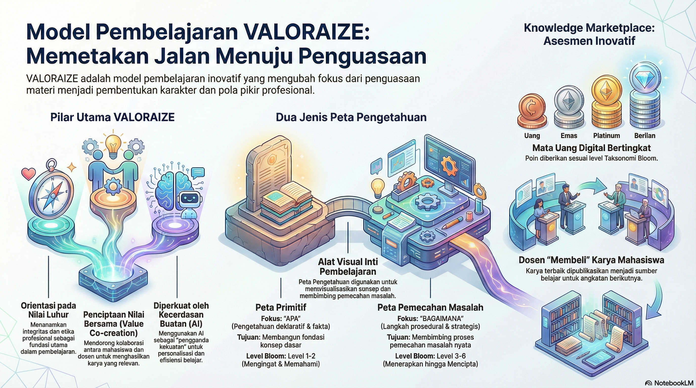

<<<<<<< HEAD
## UAS-2 My Opinions
=======
# UAS-2 My Opinions
>>>>>>> 7b0dbeadbf3074b08f16c9e765eb9abf42d8112d

My Opinions: Sintesis Krisis, Komunikasi, dan Teknologi
1. Teknologi Tanpa Komunikasi adalah Investasi yang Sia-sia Menurut pendapat saya, banyak proyek infrastruktur air bersih gagal bukan karena teknologinya (STI) tidak mumpuni, melainkan karena kegagalan komunikasi interpersonal. Kita sering terjebak pada pemikiran bahwa menyediakan sensor IoT atau aplikasi monitoring sudah cukup. Padahal, tanpa komunikasi yang mengedepankan Local Framing, masyarakat mungkin akan merasa terasing atau bahkan menolak teknologi tersebut karena dianggap asing bagi budaya mereka. Teknologi harus berfungsi sebagai pendukung (enabler) bagi hubungan antarmanusia, bukan penggantinya.

<<<<<<< HEAD
2. Transparansi Data adalah Bentuk Advokasi Publik yang Paling Jujur Saya berpendapat bahwa dalam Komunikasi Publik, kejujuran data yang didorong oleh STI adalah senjata terkuat. Seringkali data mengenai sanitasi disembunyikan atau "dipercantik" demi citra politik. Dengan sistem informasi yang terdesentralisasi (seperti penggunaan blockchain atau database publik yang transparan), publik dapat memiliki kontrol sosial. Pendapat saya adalah STI harus digunakan untuk memberikan "suara" bagi angka-angka statistik tersebut, sehingga krisis air tidak lagi dianggap sebagai angka abstrak, melainkan urgensi nyata yang menuntut tanggung jawab pemerintah.

3. Urgensi Desain Sistem yang Human-Centric (Berpusat pada Manusia) Melihat target SDG 6 tahun 2030, pendapat saya adalah kita membutuhkan pergeseran paradigma dalam pengembangan Sistem Teknologi Informasi. Pengembang sistem (seperti kita di jurusan STI) tidak boleh hanya memikirkan efisiensi algoritma atau skalabilitas database, tetapi harus memikirkan User Experience (UX) bagi masyarakat pelosok. Jika aplikasi pelaporan air sulit digunakan oleh orang awam, maka feedback loop komunikasi interpersonal akan terputus. Keberhasilan teknologi diukur dari seberapa mampu ia memfasilitasi komunikasi yang inklusif bagi mereka yang paling membutuhkan.
=======
Bagiamana menjaadi menarik? [Menjadi Menarik](./Interesting.mp4)

Ini adalah opini tentang **perubahan drastis** yang harus diterapkan dalam pembelajaran ilmu rekayasa di era Kecerdasan Buatan (Artificial Intelligence/AI), dengan mengusulkan **VALORAIZE Learning** sebagai solusi untuk mentransformasi ruang kelas menjadi miniatur lingkungan kerja profesional.

**Transformasi Pendidikan Rekayasa di Era AI: Dari Pembelajaran Hafalan ke Penciptaan Nilai**

## I. Krisis Model Konvensional di Tengah Supremasi AI

Pembelajaran ilmu rekayasa dihadapkan pada pergeseran paradigma yang fundamental dan **berubah drastis**. Akselerasi kemampuan teknologi, terutama dalam domain Kecerdasan Buatan (AI), telah memicu krisis naratif yang mendalam, di mana keunggulan manusia dipertanyakan.

Model pembelajaran konvensional—yang menekankan kuliah, penguasaan **pengetahuan deklaratif** (fakta dan definisi), dan **ujian tradisional**—**tidak lagi efektif**. Hal ini disebabkan karena AI, khususnya Large Language Models (LLMs), telah mencapai kesempurnaan dalam mode berpikir **"paradigmatik"** (logika, formal, kategorisasi, dan komputasi) pada skala dan kecepatan yang jauh melampaui kapasitas manusia.

Konsekuensinya, mahasiswa dapat menggunakan AI sebagai **"Juru Tulis Cerdas"** (*Smart Scribe*) atau **"pengganda kekuatan"** (*power multiplier*) untuk **menjawab ujian dengan benar tanpa menguasai materi secara mendalam**. Kekuatan AI dalam mengorganisir informasi dan mengeksekusi tugas-tugas kompleks membebaskan kapasitas kognitif manusia. Jika penilaian masih berfokus pada jawaban akhir (yang dapat dihitung oleh mesin), maka tujuan belajar yang sejati—yaitu kebijaksanaan, tujuan, dan kemampuan untuk menulis kisah hidup yang bermakna—terkikis.

Oleh karena itu, rekayasa pendidikan harus bergeser dari tujuan konvensional rekayasa yang berfokus pada "menyelesaikan masalah" menuju visi yang lebih luhur: **"memberdayakan pemangku kepentingan manusia untuk menyelesaikan masalah mereka sendiri"**.

## II. Ruang Kelas sebagai Lingkungan Kerja Rekayasawan

Pergeseran ini menuntut transformasi radikal di mana **ruang kelas menjadi miniatur lingkungan kerja rekayasawan**. Mahasiswa tidak boleh lagi hanya menjadi **penerima pasif** atau "Aktor/Musisi yang mengeksekusi bagiannya". Sebaliknya, mereka **perlu mendapat pengalaman dini sebagai rekayasawan** dengan mengambil peran sebagai **"Protagonis-Penulis"** yang memiliki otoritas dan agensi atas cerita mereka.

Dalam lingkungan rekayasa, tujuannya adalah merancang skema untuk **ko-kreasi nilai** (*value co-creation*), di mana para pemangku kepentingan bertukar **energon** (kapasitas melakukan usaha—seperti waktu, tenaga, dan pengetahuan) untuk memperoleh apa yang dibutuhkan. Inovasi adalah skema baru dalam merangkai berbagai elemen artefak untuk menjadi sebuah lingkungan kerja yang berkelanjutan (*sustainable*).

## III. VALORAIZE Learning: Model Ko-Kreasi Nilai di Kelas

Untuk memfasilitasi transformasi ini, **pembelajaran VALORAIZE** diusulkan. Filosofi utama VALORAIZE adalah **membawa simulasi profesi ke dalam ruang kelas** dan mengalihkan fokus dari penguasaan materi belaka ke **pembentukan sosok, karakter, dan pola berpikir profesional** yang komprehensif.

Dalam model ini, mahasiswa belajar menjadi sosok rekayasawan melalui proses berikut:

### 1. Penguasaan Materi melalui Penciptaan Artefak Pengetahuan

Mahasiswa memproduksi **Produk Pengetahuan** (artefak pembelajaran) yang merepresentasikan pemahaman mendalam mereka dan memiliki **nilai nyata** yang dapat dimanfaatkan oleh orang lain. Ini adalah praktik otentik penguasaan materi yang dapat divalidasi:

*   **Pembuatan Peta Pengetahuan Primitif:** Mahasiswa **mempraktekkan penguasaan materi** dengan mengorganisir **pengetahuan deklaratif** (fakta dan definisi), berfokus pada "Apa" dari pengetahuan, dan umumnya menguji tingkat Mengingat dan Memahami (Level 1-2 Taksonomi Bloom).
*   **Penyusunan Peta Pengetahuan Aplikatif:** Mahasiswa **menyusun peta pengetahuan aplikatif** yang bersifat dinamis dan berorientasi proses. Peta ini berfokus pada "Bagaimana" dari pengetahuan, mengintegrasikan konsep dengan langkah-langkah prosedural. Peta ini dirancang untuk membimbing proses pemecahan masalah dan menguji kemampuan Menerapkan, Menganalisis, Mengevaluasi, hingga Menciptakan (Level 3-6 Bloom).

### 2. Menjual di Pasar Pengetahuan (Knowledge Marketplace)

Penilaian diubah dari ujian pasif menjadi aktivitas ekonomi-intelektual yang disebut **Knowledge Marketplace**. Model asesmen inovatif ini dirancang untuk memberikan **"rasa menciptakan nilai"** kepada mahasiswa.

*   **Peran Mahasiswa dan Dosen:** Dosen bertindak sebagai **"Pencipta Kebutuhan"** dengan mengiklankan kebutuhan akan karya pengetahuan. Mahasiswa bertindak sebagai **"Pencipta Nilai"** dengan merespons melalui produksi artefak (peta pengetahuan).
*   **Mata Uang Pembelian:** Karya mahasiswa **dijual di pasar pengetahuan** untuk kemudian **dibeli dosen dengan berbagai jenis mata uang** digital berjenjang dan mata uang fiat:
    *   **Mata uang digital** (Poin Uang, Poin Emas, Poin Platinum, Poin Berlian) terkait langsung dengan tingkat Taksonomi Bloom yang diuji dalam peta yang dibuat (Level 1-6).
    *   **Mata uang fiat** (misalnya, IDR, USD, EUR) dikaitkan dengan domain teknis spesifik untuk mendorong eksplorasi area tertentu.

### 3. Nilai Akhir Berbasis Portofolio Kekayaan Rekayasawan

Di akhir pembelajaran, nilai akhir (*grade*) tidak lagi didasarkan pada ujian tunggal, melainkan pada portofolio kekayaan yang telah dikumpulkan, yang disebut **portofolio kekayaan rekayasawan**.

*   **Pemberian Nilai Akhir (*Grade*):** Total **"harta" terkumpul** (poin dan mata uang fiat) diindeks untuk **nilai akhir mata kuliah**.
*   **Manfaat Portofolio:** Portofolio ini tidak hanya menilai hasil (*product*), tetapi juga **proses dan perjuangan** mahasiswa dalam menulis **Jurnal Pembelajar Reflektif**—mencakup perjuangan, alat yang dipakai, kegagalan, terobosan, dan pelajaran yang dipetik. Hal ini sejalan dengan tujuan TISE 2.0 untuk memastikan mahasiswa adalah **Protagonis-Penulis** yang memahami *Penalaran Otobiografis* dan membangun narasi *Agensi* pribadi mereka.

Pendekatan VALORAIZE ini secara struktural melindungi integritas akademik dengan mengalihkan penekanan penilaian dari jawaban tunggal menuju **bukti penguasaan materi yang otentik dan penciptaan nilai kolektif**.
>>>>>>> 7b0dbeadbf3074b08f16c9e765eb9abf42d8112d
